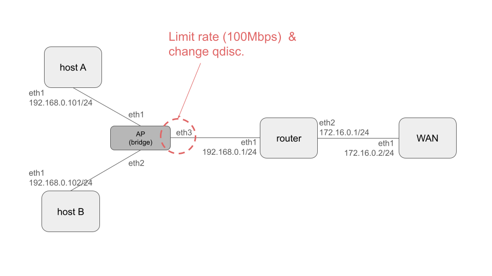

# Queuing discipline test network


You can test the difference in fairness by queueing discipline.

## requirements
- ubuntu 20.04 or later
- container lab
- iproute2
- tc


## how to use

1. deploy
```bash
# create bridge manually
make bridge

# deploy topology
make deploy
```
2. change qdisc
- rate limit only : `make enable-simple-tc`
- rate limit and unfair queue : `make enable-unfair-tc`
- rate limit and fair queue : `make enable-fair-tc`


3. evaluation
- Start two iperf server processes at WAN.
```bash
sudo ./exec.sh wan iperf3 -s &
# change port
sudo ./exec.sh wan iperf3 -s -p 5301 &
```
- Run iperf from host A and after a while run iperf from host B.

```bash
./exec.sh hostA iperf3 -c 172.16.0.2 -t 9999
```

```bash
./exec.sh hostB iperf3 -c 172.16.0.2 -p 5301 -t 9999
```

## evaluation memo
### fair queue (sfq) 
host A: about 50 Mbps
host B: about 50 Mbps

### unfair queue (default, pfifo)
host A: about 60 Mbps
host B: about 40 Mbps

